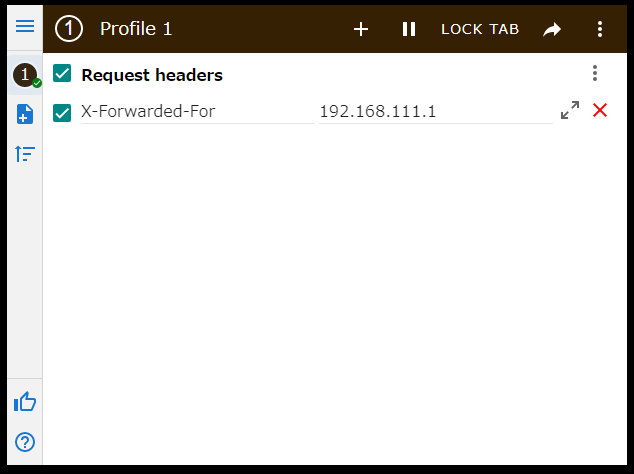
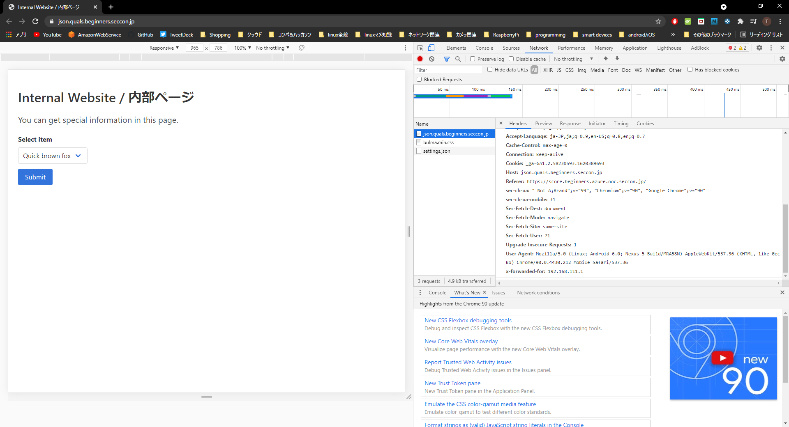

#### 作成日: 2021/07/11

# [Web] json - 109 points

## Description:
外部公開されている社内システムを見つけました。このシステムからFlagを取り出してください。  
https://json.quals.beginners.seccon.jp/  
[json.tar.gz](json.tar.gz) ce98dc233a9d77370045f306eb80cf73a17016f3
## Hints:
None.

## Solution:
ブラウザにアクセスすると、「このページはローカルネットワーク(192.168.111.0/24)内の端末からのみ閲覧できます」と出力され、クライアント側のグローバルIPも表示される。  
圧縮ファイルにある[default.conf](file/nginx/default.conf)よりwebサーバはnginxで動いており、クライアントはリバースプロキシを通過してサーバにアクセスしていることが分かる。  
また、default.confの7行目に記述されている```proxy_set_header X-Forwarded-For $proxy_add_x_forwarded_for;```より、クライアントのIPをフォワードしているため、HTTPリクエストでこの値を```192.168.111.1```に設定することで、クライアントIPを偽装する。  
Chromeの拡張機能(ここでは「modheader」を使用)でHTTPリクエストを投げる場合は下記画像の通りとなる。  

  

  

curlコマンドを使用する場合は下記を実行する。  
```$ curl -H 'X-Forwarded-For: 192.168.111.1' https://json.quals.beginners.seccon.jp/```  

続いて「Select Item」にあるFlagを選択すると、"error": "It is forbidden to retrieve Flag from this BFF server."と出力され、BFFサーバによりブロックされてFlagが表示されない。  
圧縮ファイルのBFFディレクトリ配下にある```main.go```の62~64行目でinfo.ID=2だと上記メッセージが出力されるようである。  
しかし、APIディレクトリにある```main.go```の35-40行目ではid=2だとFlagが取得できる、という仕組みになっている。  
ここで、重複キーによるHTTPリクエストを投げてみる。goの標準ライブラリだと重複キーを読み込むとき、最後のキーのみ格納されるが、APIディレクトリの```main.go```7行目より、```github.com/buger/jsonparser```では前のキーが読み込まれるようである。  
この特性を利用し、下記コマンドを実行するとFlagが取得できる。  
```$ curl -X POST -H 'X-Forwarded-For: 192.168.111.1' -d '{"id":2, "id":0}' https://json.quals.beginners.seccon.jp/```
