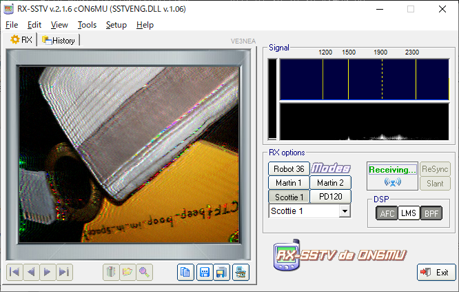

#### 作成日: 2021/01/31

# [Forensics] m00nwalk - 250 points

## Description:

Decode this [message](https://jupiter.challenges.picoctf.org/static/d6fcea5e3c6433680ea4f914e24fab61/message.wav) from the moon.

## Hints:

- How did pictures from the moon landing get sent back to Earth?
- What is the CMU mascot?, that might help select a RX option

## Solution:

この音声ファイルはSlow Scan Television (SSTV)と呼ばれる、画像を音声として無線信号を送る方式を利用したものである。  
ここでは[RX-SSTV](http://users.belgacom.net/hamradio/rxsstv.htm)というSSTVソフトウェアを使って画像を復元してみる。ちなみに上記2番目のHintsよりCMUのマスコットキャラクターはScottieなので、RX optionをScottie 1に設定して音声->画像変換を試みる。

復元した画像に記載されているのがflag。

