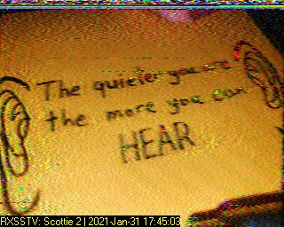

#### 作成日: 2021/01/31

# [Forensics] m00nwalk2 - 300 points

## Description:

Revisit the last transmission. We think this [transmission](https://jupiter.challenges.picoctf.org/static/599404f0bf7426a5a5c2deb538860cda/message.wav) contains a hidden message.  
There are also some clues [clue 1](https://jupiter.challenges.picoctf.org/static/599404f0bf7426a5a5c2deb538860cda/clue1.wav), [clue 2](https://jupiter.challenges.picoctf.org/static/599404f0bf7426a5a5c2deb538860cda/clue2.wav), [clue 3](https://jupiter.challenges.picoctf.org/static/599404f0bf7426a5a5c2deb538860cda/clue3.wav).

## Hints:

Use the clues to extract the another flag from the .wav file

## Solution:

まずはclue1, 2, 3の音声ファイルから画像に変換してみる。





Hintsより元の音声ファイルをステガノグラフィー解析してflagを取得するとのこと。  
clue1からPasswordが```hidden_stegosaurus```、clue2は```The quieter you are the more you can HEAR```、clue3は```Alan Eliasen the FutureBoy```と記載されている。  
clue3のメモでググると下記のウェブページがヒットする。


このページのSteganographyツールを利用して、元音声ファイルとパスワード```hidden_stegosaurus```として復元するとflagが表示される。  
(※steghideコマンドで展開することも可能)