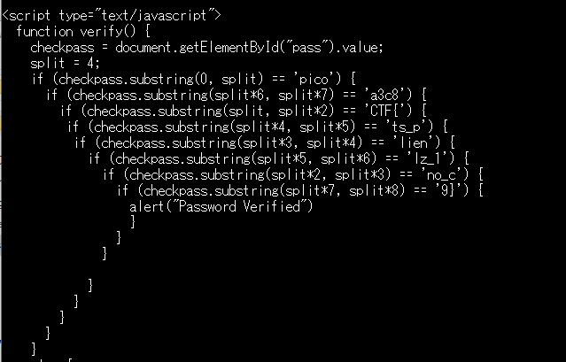

#### 作成日: 2021/03/10

# [Web] dont-user-client-side - 100 points

## Description:

Can you break into this super secure portal?  
https://jupiter.challenges.picoctf.org/problem/37821/  or http://jupiter.challenges.picoctf.org:37821

## Hints:
Never trust the client

## Solution:

  
htmlのソースコードより、入力値を4文字ずつ区切って並べ替えていることが分かる。正しい順に並べ直したものがFLAGとなる。  
1\~4文字目が```'pico'```  
5\~8文字目が```'CTF{'```  
9\~12文字目が```'no_c'```  
13\~16文字目が```'lien'```  
17\~20文字目が```'ts_p'```  
21\~24文字目が```'lz_1'```  
25\~28文字目が```'a3c8'```  
29\~30文字目が```'9}'```  


