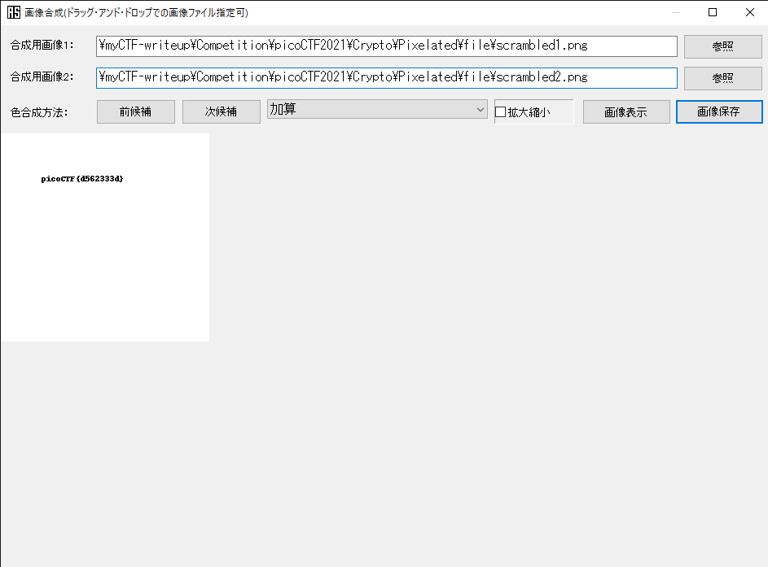

#### 作成日: 2021/05/12

# [Crypto] Pixelated - 200 points

## Description:
I have these 2 images, can you make a flag out of them? [scrambled1.png](file/scrambled1.png) [scrambled2.png](file/scrambled2.png)
## Hints:
- https://en.wikipedia.org/wiki/Visual_cryptography
- Think of different ways you can "stack" images

## Solution:
ヒントに記載されているように本問題は視覚暗号(Visual Cryptography)を用いており、複数画像を重ね合わせることで元画像に復号することができる。  
バイナリエディタの「青い空を見上げればいつもそこに白い猫」を起動し、[参照]をクリックしてscrambled1.pngを選択する。  
次に、[ステガノグラフィー解析] > [画像合成]をクリックし、合成用画像2の[参照]からscrambled2.pngを選択する。  
合成方法を加算にすると、下記画像のようにノイズが消えてFLAGが表示される。 

