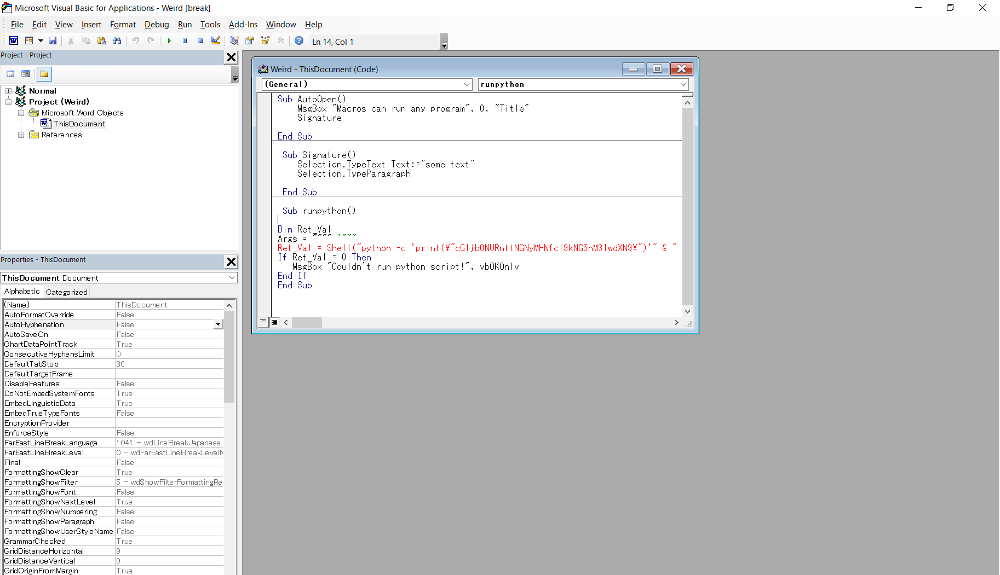

#### 作成日: 2021/04/16

# [Forensics] Weird File - 20 points

## Description:
What could go wrong if we let Word documents run programs? (aka "in-the-clear"). [Download file](https://mercury.picoctf.net/static/31e3d7f6233eae5aef3a01ba0846a705/weird.docm).

## Hints:

## Solution:

Microsoft Wordで開き、[表示]タブ > [マクロの表示]を選択し、```runpython```というマクロを表示する。  
※あらかじめ、マクロを有効化しておくこと。  
※[ファイル]タブ > [オプション] > [セキュリティセンター] > [セキュリティセンターの設定] > [マクロの設定]を選択し、必要なオプションを選択する。


pythonでprintfしている行の文字列をBase64でデコードするとFLAGが表示される。


