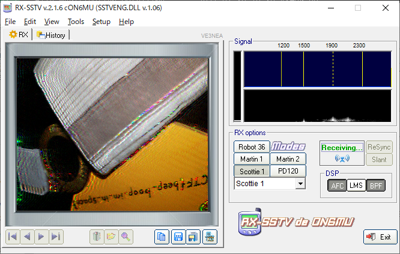

#### 作成日: 2021/01/31

# [Forensics] WhitePages - 250 points

## Description:

I stopped using YellowPages and moved onto WhitePages... but [the page they gave me](https://jupiter.challenges.picoctf.org/static/74274b96fe966126a1953c80762af80d/whitepages.txt) is all blank!

## Hints:
(None)

## Solution:


リンク先のテキストファイル```whitepages.txt```を開くと、半角スペースと全角スペースが混在している。  
これらを0と1に置き換えてbinary -> ascii 変換を行うとflagが表示される。  
  


# [Forensics] m00nwalk - 250 points

## Description:

Decode this [message](https://jupiter.challenges.picoctf.org/static/d6fcea5e3c6433680ea4f914e24fab61/message.wav) from the moon.

## Hints:

- How did pictures from the moon landing get sent back to Earth?
- What is the CMU mascot?, that might help select a RX option

## Solution:

この音声ファイルはSlow Scan Television (SSTV)と呼ばれる、画像を音声として無線信号を送る方式を利用したものである。  
ここでは[RX-SSTV](http://users.belgacom.net/hamradio/rxsstv.htm)といのSSTVソフトウェアを使って画像を復元してみる。ちなみに上記2番目のHintsよりCMUのマスコットキャラクターはScottieなので、RX optionをScottie 1に設定して音声->画像変換を試みる。




復元した画像に記載されているのがflag。

# [Forensics] m00nwalk2 - 300 points

## Description:

Revisit the last transmission. We think this [transmission](https://jupiter.challenges.picoctf.org/static/599404f0bf7426a5a5c2deb538860cda/message.wav) contains a hidden message.  
There are also some clues [clue 1](https://jupiter.challenges.picoctf.org/static/599404f0bf7426a5a5c2deb538860cda/clue1.wav), [clue 2](https://jupiter.challenges.picoctf.org/static/599404f0bf7426a5a5c2deb538860cda/clue2.wav), [clue 3](https://jupiter.challenges.picoctf.org/static/599404f0bf7426a5a5c2deb538860cda/clue3.wav).

## Hints:

Use the clues to extract the another flag from the .wav file

## Solution:

まずはclue1, 2, 3の音声ファイルから画像に変換してみる。


Hintsより元の音声ファイルをステガノグラフィー解析してflagを取得するとのこと。  
clue1からPasswordが```hidden_stegosaurus```、clue2は```The quieter you are the more you can HEAR```、clue3は```Alan Eliasen the FutureBoy```と記載されている。  
clue3のメモでググると下記のウェブページがヒットする。


このページのSteganographyツールを利用して、元音声ファイルとパスワード```hidden_stegosaurus```として復元するとflagが表示される。  
(※steghideコマンドで展開することも可能)